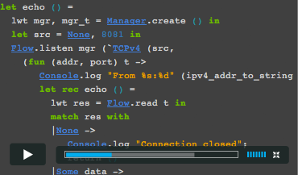

    <h1>Documentation</h1>

    

        <section class="span6 condensed">
            <h1 class="ruled">Summary</h1>
            
Lorem ipsum dolor sit amet, consectetur adipisicing elit, sed do eiusmod tempor incididunt ut labore et dolore magna.

            
Lorem ipsum dolor sit amet, consectetur adipisicing elit sed. Lorem ipsum dolor sit amet.

        </section>
        <section class="span6 condensed">
            <h1 class="ruled">Reference</h1>
            

                <a href="#" class="span3 documentation-highlight">
                    
                    OCaml Manual
                </a>
                <a href="#" class="span3 documentation-highlight">
                    
                    OCaml License
                </a>
            

            

                <a href="#" class="span3 documentation-highlight">
                    
                    Package Documents
                </a>
                <a href="#" class="span3 documentation-highlight">
                    
                    Cheat Sheets
                </a>
            

        </section>
    

    

        <section class="span6 condensed">
            <h1 class="ruled">OPAM Docs</h1>
            
Lorem ipsum dolor sit amet, consectetur adipisicing elit, sed do eiusmod tempor incididunt ut labore et dolore magna aliqua. Ut enim ad minim veniam, quis nostrud exercitation ullamco laboris nisi ut aliquip ex ea commodo consequat. Duis aute irure dolor in reprehenderit in voluptate velit esse cillum dolore eu fugiat nulla pariatur.

            
Sed ut perspiciatis unde omnis iste natus error sit voluptatem accusantium doloremque laudantium, totam rem aperiam, eaque ipsa quae ab illo inventore veritatis et quasi architecto beatae vitae dicta sunt explicabo. Nemo enim ipsam voluptatem quia voluptas sit aspernatur aut odit aut fugit, sed quia consequuntur magni dolores eos qui ratione voluptatem sequi nesciunt.

        </section>
        <section class="span6 condensed">
            <h1 class="ruled">OCaml Book</h1>
            

                

                    
                

                

                    
This hands-on book shows you how to take advantage of OCaml’s functional, imperative and object-oriented programming styles with recipes for many real-world tasks.

                    
Starting with OCaml basics, including interactive examples, you’ll move toward more advanced topics such as the module system, foreign-function interface and build system.

                    
<a href="#">Read Free Online</a>

                

            

        </section>
    

    

        <section class="span12 condensed">
            <h1 class="ruled">Videos</h1>
            

                
                    

                        

                            
                        

                        
Lorem ipsum dolor sit amet, consectetur adipisicing elit, sed do eiusmod tempor incididunt ut labore et dolore magna. Duis aute irure dolor in reprehenderit in voluptate.

                    

                
            

        </section>
    

