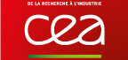

Recevoir de l'aide et contribuer
================================

Le développement d'OCaml est dirigé par
l'[Inria](http://caml.inria.fr/). La communauté des développeurs OCaml
vous aidera volontiers sur la [liste de diffusion
officielle](mailing_lists.html). Un support commercial est fourni par
[OCamlPro](#ocamlpro).

Le Consortium à l'Inria
-----------------------

e Consortium OCaml fédère les efforts de conception et de développement
du langage OCaml et de son environnement. Le Consortium permet à ses
membres de montrer leur intérêt pour le langage OCaml et de soutenir son
développement. Ils bénéficient de plus d'une [license
spécifique](consortium/license.html).

La cotisation annuelle des membres peut être ou bien très modeste
(3000€) ou plus conséquente (10000€ ou plus) selon le niveau de soutien
que le membre désire apporter. L'adhésion au Consortium OCaml est un
acte important, non seulement pour le développement du langage et sa
dissémination, mais aussi pour sa pérennité.

### Membres

  ----------------------------------------------------------- ------------------------------------------------------------------------------------ ----------------------------------------------------------------------------------------
                                                   
         
                                
                                  
  ----------------------------------------------------------- ------------------------------------------------------------------------------------ ----------------------------------------------------------------------------------------

### Comment adhérer ?

Pour vous permettre d'adhérer en toute connaissance de cause au
Consortium OCaml, il vous est possible au préalable de consulter en
ligne l'accord de partenariat et ses annexes, disponible au format
[PDF](http://caml.inria.fr/consortium/agreement.fr.pdf). Voir aussi la
fiche d'[informations concernant la
TVA](http://caml.inria.fr/consortium/vat.fr.html).

Si les clauses du Consortium vous agréent, vous pourrez alors compléter
et envoyer le [formulaire
d'adhésion](http://caml.inria.fr/consortium/form.fr.html) disponible en
ligne. Cette demande sera examinée par un représentant habilité de
l'Inria qui vous recontactera ensuite pour organiser la signature de
l'accord en deux exemplaires.

Après signature par un représentant de votre entreprise/organisme et par
un représentant habilité de l'Inria, une facture correspondant au
montant de votre participation financière vous sera envoyée.

Support commercial par OCamlPro
-------------------------------

Un support commercial est fourni par
[OCamlPro](http://www.ocamlpro.com/). OCamlPro offre un éventail de
services, du simple support au développement avancé en OCaml, des
formation et de la consultance.
